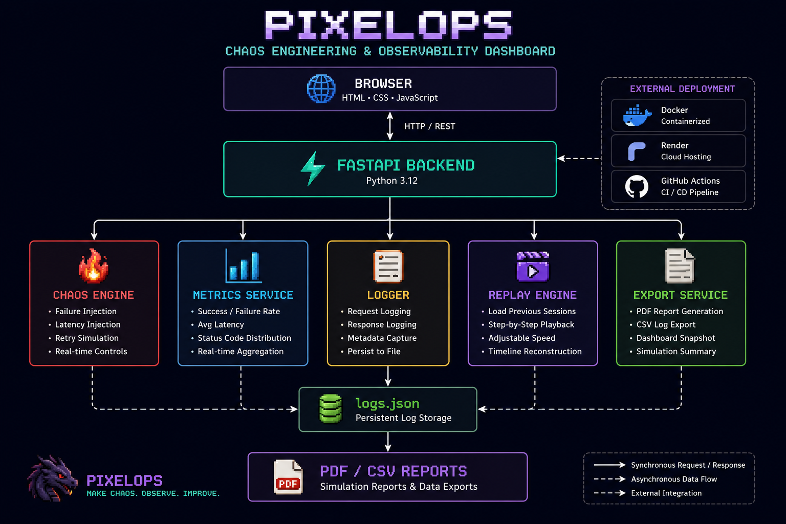
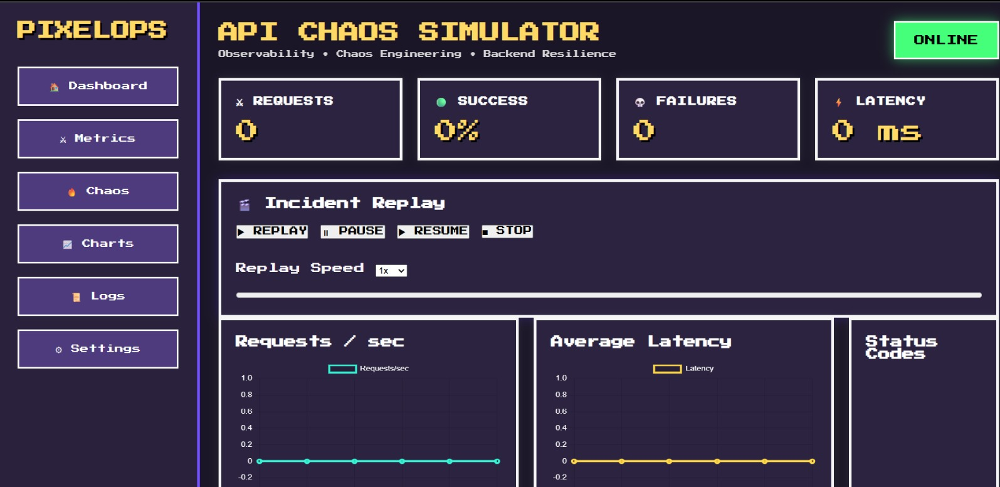
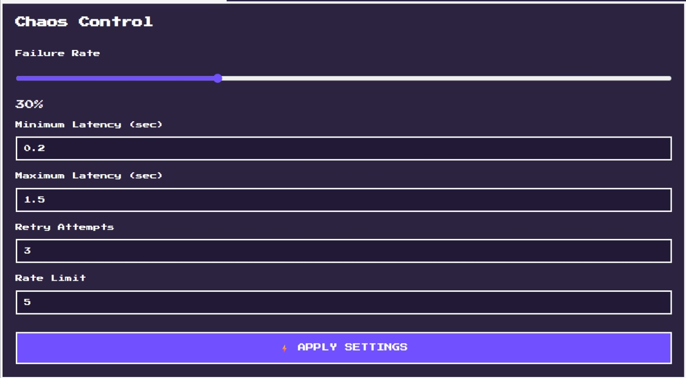
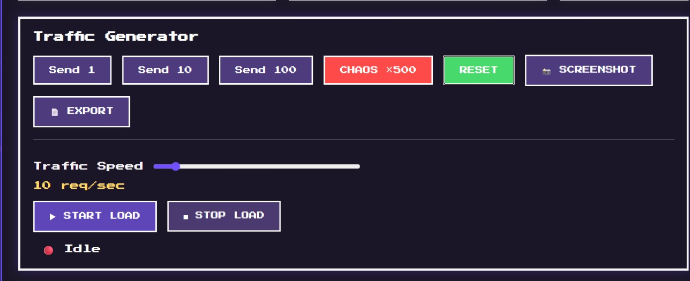

# 🚀 PixelOps – Resilient FastAPI Chaos Simulator

> A production-inspired FastAPI system for chaos engineering, observability, resilience testing, and backend monitoring.


[](https://resilient-fastapi-system.onrender.com/)

---
<p align="center">
  
</p>

---

## 📌 Overview

PixelOps is a resilient backend simulator built with FastAPI that demonstrates concepts commonly used in production backend systems.

Instead of being a CRUD application, PixelOps focuses on:

- Chaos Engineering
- Retry Logic
- Rate Limiting
- Failure Injection
- Live Monitoring
- Replayable Request History
- Metrics Collection
- Containerization
- CI/CD

The project visualizes how backend services behave under stress while exposing real-time metrics through an interactive dashboard.

---

# 💡 Why PixelOps?

Most backend portfolio projects focus on CRUD APIs.

PixelOps instead simulates real production challenges such as latency spikes, transient failures, retry mechanisms, rate limiting, observability, and replayable incidents, making it a practical demonstration of backend resilience engineering.

---

# ✨ Features

## ⚔ Chaos Engine

Configure backend failures in real time.

- Adjustable failure rate
- Random latency injection
- Retry mechanism
- Rate limiting
- Live configuration updates

---

## 📊 Live Dashboard

Interactive monitoring dashboard displaying

- Request count
- Success rate
- Failure count
- Average latency
- Status code distribution
- Live request table
- Chaos Boss health meter

---

## 📈 Metrics Collection

Tracks

- Total requests
- Successful requests
- Failed requests
- Success %
- Average latency
- Retry attempts
- HTTP status distribution

---

## 🔁 Replay Mode

Replay historical API sessions exactly as they occurred, rebuilding dashboard metrics frame-by-frame from stored logs.

Features include

- Timeline playback
- Adjustable replay speed
- Frame-by-frame metrics reconstruction
- Historical dashboard recreation

---

## 📜 Logging

Every request is logged with

- Timestamp
- Endpoint
- Client IP
- Status
- Latency
- Retry count
- Response payload

Logs are stored locally as JSON.

---

## 📄 Report Export

Generate reports directly from the dashboard.

Includes

- PDF report
- CSV log export

---

## 🐳 Docker Support

Containerized using Docker.

Run locally with

```bash
docker compose build
docker compose up
```

---

## ⚙ CI/CD

GitHub Actions automatically

- Installs dependencies
- Builds project
- Runs automated tests
- Validates Docker build


# 🧩 Project Structure

```
PixelOps/

├── app/
│   ├── services/
│   │      chaos_engine.py
│   │      chaos_config.py
│   │      export_service.py
│   │      logger.py
│   │      metrics.py
│   │      rate_limiter.py
│   │      replay_service.py
│   └── main.py
│
├── static/
│   ├── css/
│   └── js/
│
├── templates/
│      dashboard.html
│
├── data/
│      logs.json
│
├── reports/
│
├── Dockerfile
├── docker-compose.yml
├── requirements.txt
└── README.md
```

---

# 🏗 Architecture Diagram

```
             Dashboard (HTML/CSS/JS)
                     │
                     ▼
             FastAPI Application
                     │
     ┌───────────────┼────────────────┐
     │               │                │
     ▼               ▼                ▼
 Chaos Engine     Metrics        Replay Service
     │               │                │
     └───────────────┼────────────────┘
                     ▼
              Logger Service
                     │
                     ▼
                logs.json
```

---

## System Architecture

 

---

## Dashboard



---

## Chaos Controls



---

## Traffic Generator



---


---

# 🚀 Running Locally

Clone repository

```bash
git clone https://github.com/Taksui/PixelOps.git
```

Enter directory

```bash
cd PixelOps
```

Install dependencies

```bash
pip install -r requirements.txt
```

Run server

```bash
uvicorn app.main:app --reload
```

Open

```
http://127.0.0.1:8000
```

---

# 🐳 Docker

```bash
docker compose up --build

```

---

# 📈 Technologies Used

- Python
- FastAPI
- JavaScript
- HTML5
- CSS3
- Chart.js
- Docker
- GitHub Actions
- Render

---

# 🎯 Learning Objectives

This project explores practical backend engineering concepts including

- Resilient API design
- Chaos engineering
- Retry strategies
- Rate limiting
- Observability
- Monitoring
- Containerization
- CI/CD workflows
- Backend logging
- Interactive dashboards

---

# 🔮 Future Improvements

- Kubernetes deployment
- Prometheus metrics
- Grafana dashboards
- Distributed tracing
- WebSocket live updates
- Authentication
- PostgreSQL log storage

---

# 👨‍💻 Author

**Dave Aashisth(Taksui)**

Backend Engineering • AI Systems • Distributed Systems

Open to Software Engineering and Backend Development opportunities.

---